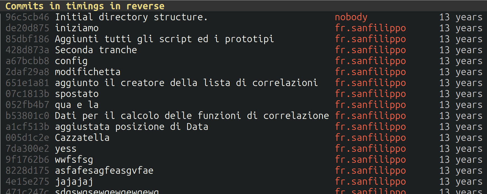

# Nissa wip

### Aim: 
* Target different architecture (GPU, CPU, and maybe other in the future), which needs different data layout/access pattern
* Allow to write general code which specify algorithms which operates on various data type/theories
* Simplify (?) writing code for lattice QCD
* Have a good efficency

### Nissa code, a bit of history

Written **since 2010** to provide a new framework replacing the TAO code used on APE machine (up to Nazario era).

Rushed a bit, to be used in the BG/P Cineca machine Fermi, to profit from the opportunities of the first PRACE projects



Employed in many many flavor physics projects within ETM/RM123 & staggered stout HMC with Pisa collaboration.

#### Current status 

Work in progress to use C++20 metaprogramming to let `c++` understand tensor algebra.
Allows to generate automatically contractions, supporting distributed data on cpu or gpu.

### Several experiments (since 2018 in C++17)

* [SUNphi](https://github.com/sunpho84/SUNphi.git) studied metaprogramming

* [CICCIO'S](https://github.com/qcdcode/ciccio-s.git||https://github.com/qcdcode/ciccio-s.git) simplified 

* [MAZE](https://github.com/sunpho84/maze.git||https://github.com/sunpho84/maze.git) a-mazingly simple

and more, now all tests have been moved directly in nissa.

### Tensor algebra

```c++
  DynamicTens<OfComps<LocLxSite,Dir>,double> tens(lat->getLocVol());`
```

allocates a tensor with a static-sized Lorentz index `Dir` and a dynamical-size specified index `LocLxSite`

One can add as many component as needed, and create new components

``` c++
  DECLARE_TRANSPOSABLE_COMP(Color,int,NCOL,color);
  DynamicTens<OfComps<LocLxSite,Dir,Color>,double> tens1(lat->getLocVol());
  DynamicTens<OfComps<Dir,LocLxSite,Color>,double> tens2(lat->getLocVol());
```

automatic understand tensor algebra

```c++
  DynamicTens<OfComps<LocLxSite,Color,Dir>,double> tens3=tens1*tens2;                            /// Direct product
  DynamicTens<OfComps<LocLxSite,ColorRow,ColorCln,DirRow,DirCln>,double> tens4=tens1*dag(tens2); /// Outer product
  DynamicTens<OfComps<LocLxSite>,double> tens5=dag(tens1)*tens2;                                 /// Scalar prodcut
```

Indices can be accessed via member methods or subscribing. Partial subscribing is supported, order of subscription is irrelevant. The constructions

```c++
  tens4.colorRow(0).locLxSite(52);
  tens4[ColorRow(0)][LocLxSite(52)];
  tens4(colorRow(0),locLxSite(52));
  tens4.locLxSite(52).colorRow(0);
```

are all equivalent, methods are automatically after the index is specified. Tensor support arbitrary underlying data type

```c++
  Struct FlavProperties
  {
     double charge;
  };

  DECLARE_UNTRANSPOSABLE_COMP(Flavor,int,NFLAV,flavor);
  DynamicTens<OfComps<FLAVOR>,FlavProperties> families;
  families.flavor(0).charge=0.3;

```

### Field

``` c++
  using Indices=CompsList<Dir,ColorRow,ColorCln,ComplId>;
  Field<Indices,double> conf;
```

`conf` is a field with Lorentz index `Dir`, two color indices, a complex real/imag part, of basic type double, and implicit `LoclxSite` (spacetime). Datatype can be 

Position of the `LocLxSite` w.r.t internal degrees of freedom is decided by the chosen `FieldLayoyut`.
The data is allocated on `CPU` or `GPU` depending on `MemoryType`

``` c++
  Field<Indices,double,FieldLayout::GPU,MemoryType::CPU> gpuLayoutConfAllocatedOnCPU;
```

Replication on both memory type is supported

```c++
  MirroredTens<OfComps<LocLxSite,Dir>> mirroredTens(lat->getLocVol());
```

#### Paralleling transport whatever

``` c++

auto parallelTransport(const DerivedFromNode auto& conf,
                       const DerivedFromNode auto& v,
                       const Ori& ori,
                       const Dir& dir)
{
  return conf[dir]*shift(v,ori,dir);
}
```

* `v` and `conf` can be any data structure with `LocSite` index
* `conf` must have a Lorentz index


### Computing the plaquette

Compute the plaquette of whatever (for example, an `SU(3)` gauge configuration)


```c++

template <DerivedFromTransposableComp C=Color>     /// Support any Index
double plaquette(const DerivedFromNode auto& conf) /// Support any expression
{
  ComplexScalarField squares(0.0);
  
  for(Dir mu=0;mu<NDIM;mu++)
    for(Dir nu=mu+1;nu<NDIM;nu++)
      squares+=real(traceOver<C>((parallelTransport(conf,conf[nu],bw,mu)).close()*
				                 (parallelTransport(conf,conf[mu],bw,nu)).close()));
  
  const double plaq=
    squares.glbReduce()/lat->getGlbVol()/(2*sqr(C::size));
  
  return plaq;
}

```

* `conf` allocated on `gpu` -> kernels are issued
* `conf` allocated on `cpu` -> thread loop is issued
* all loops are issued
* small loops are unrolled


### Todo

* Autotuner, improve specific operations e.g. reductions
* Rebuild the nissa code to take advantage of the new API

### Meantime (intermezzo)

A fully compile time BNF grammar parser generator, able to parse any langauge

### Example, json parser generator to parse json data at compile time

```c++
  constexpr char jsonGrammar[]=
  "json {\
     %whitespace \"[ \\t\\r\\n]*\";\
     document: '{' attributes '}' [document] | ;\
     attributes: attributes ',' attribute [add_to_object] | attribute [create_object] | ;\
     attribute: name ':' value [attribute];\
     elements: elements ',' value [add_to_array] | value [create_array] | ;\
     value:\
        null [null] |\
        boolean [value] |\
        integer [value] |\
        real [value] |\
        string [value] |\
        '{' attributes '}' [object] |\
        '[' elements ']' [array]\
     ;\
     name: \"[\\\"']:string:\";\
     null: 'null';\
     boolean: \"true|false\";\
     integer: \"(\\+|\\-)?[0-9]+\";\
     real: \"(\\+|\\-)?[0-9]+(\\.[0-9]+)?((e|E)(\\+|\\-)?[0-9]+)?\";\
     string: \"[\\\"']:string:\";\
  }";
  
  constexpr GrammarParser<jsonGrammar> jSonGrammarParser;

  constexpr char jsonText[]=/* Some json text*/;
  
  constexpr auto parsedData=jsonGrammarParser(jsonText);

  static_assert(parsedData.myParameter==42,"Check at compile failed");
```

Allow to parse parameters and serialize/deserialize data

#### A new language embedded in c++?

``` c++
  constexpr char myNewLanguageGrammar[]=
  "myNewLanguage {\
   /* all the grammar */ \
   };
   
   /* All actions supported by the language, of course to be implemented... */
   
  constexpr GrammarParser<myNewLanguageGrammar> myNewLanguageParser;
   
  constexpr char myNewCode[]= #include "mySource.my";
  
  myNewLanguageParser(myNewCode);

```

Some crazy idea: **define a grammar to specify correlation function in (say) latex & get the contractions code written for you!??**

